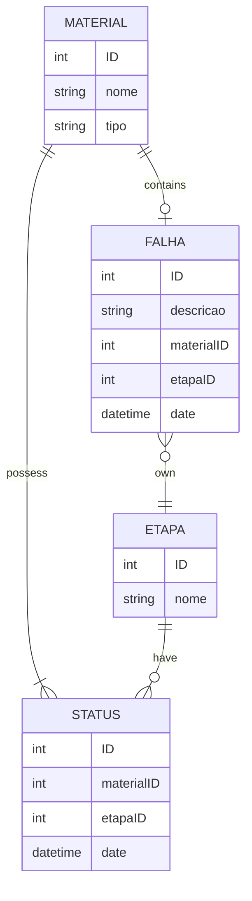

# CME--challenge
Este projeto é uma aplicação web composta por um backend em Flask e um frontend em React para gerenciar materiais hospitalares e seu processo de esterilização.

## Pré-requisitos

-  Python 3.7+
-   Node.js 14+
-   npm (Node Package Manager)
-   Git

## Configuração do Ambiente
### Clonando o Repositório

    git clone https://github.com/LarissaRC/CME--challenge.git
    cd CME--challenge

### Configuração do Backend
  > Realize esta etapa em um terminal separado, a partir do diretório \CME--challenge\
 1. Instale as dependências do backend
    ```
	pip install -r backend/requirements.txt
    ```
  	> Se necessário atualize componentes específicos do Flask.
	```
	pip install --upgrade flask werkzeug
	```
 3. Execute o servidor Flask
    ```
	cd backend
	flask run
    ```
> O backend estará disponível em **http://127.0.0.1:5000**.

### Configurações do Frontend
> Realize esta etapa em um terminal separado, a partir do diretório \CME--challenge\
1. Instale as dependências do frontend
	```
	cd frontend/cme-api
	npm install
	```

3. Execute o servidor de desenvolvimento do React
	```
	npm run dev
	```
> O frontend estará disponível em **http://127.0.0.1:3000**.

### Observações

-   Certifique-se de que o backend está em execução antes de iniciar o frontend para garantir que a API esteja acessível.
-   Caso encontre algum problema, verifique os logs no terminal onde o backend ou o frontend estão sendo executados.

## Entidades Principais

 1.   **Material**
        -   ID (chave primária)
        -   Nome
        -   Tipo (cirúrgico, descartável, etc.)
        
 2.   **Etapa**
        -   ID (chave primária)
        -   Nome (Recebimento, Lavagem, Preparo, Distribuição)
      
 3.   **Falha**
        -   ID (chave primária)
        -   Descrição
        -   MaterialID (chave estrangeira referenciando Material)
        -   EtapaID (chave estrangeira referenciando Etapa)
        -   Data e Hora
        
 4.   **Status**
        -   ID (chave primária)
        -   MaterialID (chave estrangeira referenciando Material)
        -   EtapaID (chave estrangeira referenciando Etapa)
        -   Data e Hora

## Relacionamentos

1.  **Material -> Falha**
    
    Um material pode ter zero ou mais falhas.
    
2.  **Etapa -> Falha**
    
    Uma etapa pode estar associada a zero ou mais falhas.
    
3.  **Material -> Status**
    
    Um material pode passar por várias etapas, cada uma registrada como um status.
    
4.  **Etapa -> Status**
    
    Uma etapa pode ser registrada como um status para vários materiais.
## Diagrama Entidade-Relacionamento

## Dicionário de Dados
### Tabela Material
| Campo | Tipo         | Descrição                                       | Restrição                   |
|-------|--------------|-------------------------------------------------|-----------------------------|
| ID    | INT          | Identificador único do material                 | PRIMARY KEY, AUTO_INCREMENT |
| Nome  | VARCHAR(250) | Nome do material                                | NOT NULL                    |
| Tipo  | VARCHAR(100) | Tipo do material (cirúrgico, descartável, etc.) | NOT NULL                    |

### Tabela Etapa
| Campo | Tipo         | Descrição                                       | Restrição                   |
|-------|--------------|-------------------------------------------------|-----------------------------|
| ID    | INT          | Identificador único da etapa                 | PRIMARY KEY, AUTO_INCREMENT |
| Nome  | VARCHAR(100) | Nome da etapa                                | NOT NULL                    |

### Tabela Falha
| Campo      | Tipo     | Descrição                          | Restrição                                     |
|------------|----------|------------------------------------|-----------------------------------------------|
| ID         | INT      | Identificador único da falha       | PRIMARY KEY, AUTO_INCREMENT                   |
| Descrição  | TEXT     | Descrição da falha ocorrida        | NOT NULL                                      |
| MaterialID | INT      | Referência ao ID do material       | FOREIGN KEY REFERENCES Material(ID), NOT NULL |
| EtapaID    | INT      | Referência ao ID da etapa          | FOREIGN KEY REFERENCES Etapa(ID), NOT NULL    |
| DataHora   | DATETIME | Data e hora da ocorrência da falha | NOT NULL                                      |

### Tabela Falha
| Campo      | Tipo     | Descrição                            | Restrição                                     |
|------------|----------|--------------------------------------|-----------------------------------------------|
| ID         | INT      | Identificador único do status        | PRIMARY KEY, AUTO_INCREMENT                   |
| MaterialID | INT      | Referência ao ID do material         | FOREIGN KEY REFERENCES Material(ID), NOT NULL |
| EtapaID    | INT      | Referência ao ID da etapa            | FOREIGN KEY REFERENCES Etapa(ID), NOT NULL    |
| DataHora   | DATETIME | Data e hora de atualização do status | NOT NULL                                      |
